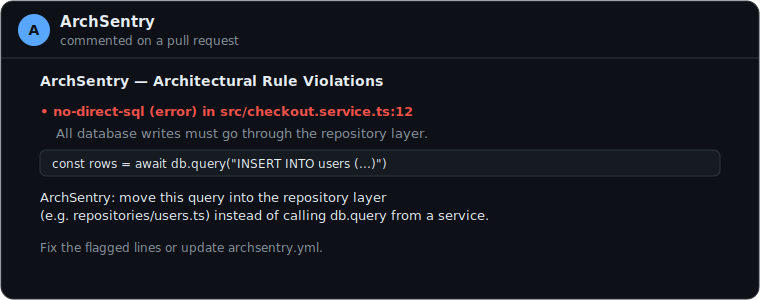

# ArchSentry

> Enforce _your_ team's architectural rules on every PR — before merge. Deterministic, config-first, and free to scan.

AI coding assistants now write the majority of enterprise code, but the review layer built for humans has broken down. ArchSentry is a GitHub App that catches AI-generated (and human) code which violates **your team's specific architectural contract** — the rules a generic SAST tool simply can't see.

- **Deterministic detection. Zero LLM cost on scan.** Rules are structured YAML, not prompts. No token is spent _finding_ a violation.
- **LLM only explains.** Once a violation is found, an LLM writes a plain-English fix hint — and silently falls back if the model is unavailable.
- **Config-first.** Your contract lives in `archsentry.yml` in the repo. No dashboard, no vendor lock-in.
- **Runs on the PR diff.** Only changed files are analyzed, in-memory, with no filesystem access.


📖 [Setup guide](SETUP.md) · [Rule examples](archsentry.yml.example)

## Try it in 60 seconds

ArchSentry runs the **exact same checks** three ways. No account, no card, no SaaS.

**Option 1 — GitHub Action (zero infra, no app).** Drop this in your repo as `.github/workflows/archsentry.yml` and push a PR:

```yaml
name: ArchSentry Scan
on:
  pull_request:
    branches: [main]
jobs:
  archsentry:
    runs-on: ubuntu-latest
    permissions:
      contents: read
      pull-requests: write
    steps:
      - uses: actions/checkout@v4
      - uses: actions/setup-node@v4
        with: { node-version: 20 }
      - run: npm install -g pnpm@10
      - run: pnpm dlx archsentry@0.2.7 scan --config archsentry.yml --path .
```

**Option 2 — Local CLI.** Point it at any folder:

```bash
npx archsentry@latest scan --config archsentry.yml --path .
```

It exits non-zero on `error` severity, so it drops straight into any CI as a gate. Add your rules (see [`archsentry.yml.example`](archsentry.yml.example)), push a PR, and ArchSentry posts the comment below.



> **GitHub App with top-level PR comments?** That's self-host: you deploy this repo and register a GitHub App (see [SETUP.md](SETUP.md)). The published `archsentry` npm package is the **CLI/Action only** — the App host lives in this repo, not on npm.

## Why not just use SAST?

SAST tools find _known vulnerability patterns_ (CVEs, insecure APIs). They have no idea what **your** architecture is — "controllers must not talk to the database directly," "all Kafka producers go through the `events` module," "no `eval` in product code." That's exactly the contract ArchSentry enforces, expressed in your own words.

|                                     | SAST   | ArchSentry                    |
| ----------------------------------- | ------ | ----------------------------- |
| Finds CVEs / insecure APIs          | ✅     | ➖ (run SAST too)             |
| Enforces _your_ team's architecture | ➖     | ✅                            |
| Cost to scan                        | varies | **free** (deterministic)      |
| Explains _why_ in your context      | ➖     | ✅ (LLM, free tier available) |

## How it works

1. `archsentry.yml` in your repo declares structured rules (a `pattern` or `semgrep` matcher + paths + severity + a description).
2. On every `pull_request.opened` / `pull_request.synchronize`, ArchSentry reads the contract from the base branch, fetches **only the changed code files**, and runs the deterministic engine in-memory.
3. Violations are posted as a PR comment — with an LLM-written explanation when configured.

The same engine powers a local CLI, so you can run the exact same checks in CI or locally:

```bash
pnpm scan --config archsentry.yml --path .
```

## Quick start

### As a CLI

```bash
npx archsentry@latest scan --config samples/dummy-target/archsentry.yml --path samples/dummy-target
```

(Or, from a clone: `pnpm install` then `pnpm scan --config …`.)

Flags the seeded violation in `controllers/user.controller.ts` and exits non-zero on `error` severity — a drop-in CI gate.

Useful flags:

- `-e, --explain` — attach an LLM/AI explanation to each violation (uses `OPENROUTER_API_KEY` / `OPENAI_API_KEY` / `OLLAMA_MODEL`, else a built-in template).
- `-s, --severity <level>` — only report `error` (or `warn`, the default) severity and above.
- `--no-fail` — report only; never exit non-zero (handy for informational scans).
- `-f, --format <text|json>` — `json` emits a machine-readable report.

### As a GitHub App

```bash
pnpm install
cp .env.example .env      # then fill in APP_ID, WEBHOOK_SECRET, PRIVATE_KEY_PATH, WEBHOOK_PROXY_URL
pnpm start               # Probot under tsx + smee-client webhook proxy
```

For local dev the webhook is relayed through Smee. **In production, use direct delivery** (point the App's Webhook URL at your host's public HTTPS endpoint, leave `WEBHOOK_PROXY_URL` unset) — see [SETUP.md](SETUP.md).

**Register the app** (one-time):

1. GitHub → Settings → Developer settings → GitHub Apps → **New GitHub App**.
2. Homepage URL: `https://github.com/comerade2134/archsentry`. Webhook URL: your Smee channel (e.g. `https://smee.io/xxxx`); Webhook secret: any string (set it in `.env` as `WEBHOOK_SECRET`).
3. Permissions: _Repository contents_ (read), _Pull requests_ (read & write). Subscribe to the **Pull request** event.
4. Create the app, download the private key (`.pem`), save it as `private-key.pem` in the repo root. Install the app on the repos you want to guard.

Then install it on a repo that has `archsentry.yml` and push a PR. See `archsentry.yml.example` for the contract format and `.env.example` for the required variables.

> **Note on the published package.** The `archsentry` package on npm is the **CLI only** (the `scan` command) — `probot` is a _dev_ dependency and is not bundled, so `pnpm dlx archsentry` can't run the App. The GitHub App is self-host: clone this repo and run `pnpm start` (the App host lives here, not on npm). There is no managed/cloud instance — you deploy it yourself if you want top-level PR comments.

### As a GitHub Action (zero infra)

Prefer a CI check over a hosted app? Drop `examples/github-action.yml` into your repo as `.github/workflows/archsentry.yml`. It installs the published `archsentry` CLI from npm and runs it on every PR — no app registration required.

## Explanations (optional, free)

Every violation comment can include a plain-English explanation. Detection is always free; the explainer is chosen from the environment (first match wins):

- `OPENROUTER_API_KEY` → any [OpenRouter](https://openrouter.ai) model, including **free** tiers like `nvidia/nemotron-3-ultra-550b-a55b:free`. No card. Checked first, so the free tier wins when both keys are set.
- `OPENAI_API_KEY` → OpenAI model (`OPENAI_MODEL`, default **gpt-4.1-mini**; billed per call). Override with `OPENAI_MODEL`.
- `OLLAMA_MODEL` → a free local model via [Ollama](https://ollama.com) (private, no key).
- none → built-in template fallback (always works).

If the chosen model errors, ArchSentry silently falls back so the comment always posts.

## Tuning & safety limits

All limits are environment variables (read per-PR, so you can tune them without a redeploy). A malformed value falls back to the default rather than silently disabling the limit.

| Variable                           | Default            | Purpose                                                                                                |
| ---------------------------------- | ------------------ | ------------------------------------------------------------------------------------------------------ |
| `ARCHSENTRY_MAX_FILE_BYTES`        | `524288` (512 KiB) | Skip a single file once fetched if it exceeds this.                                                    |
| `ARCHSENTRY_MAX_FILE_LINES`        | `5000`             | Pre-filter: don't even download a file whose diff exceeds this many changed lines.                     |
| `ARCHSENTRY_MAX_FILES`             | `300`              | Skip the whole PR (with a warning comment) if it changes more files.                                   |
| `ARCHSENTRY_MAX_BYTES`             | `5242880` (5 MiB)  | Skip the whole PR if total changed source exceeds this.                                                |
| `ARCHSENTRY_FETCH_CONCURRENCY`     | `8`                | Max parallel file downloads.                                                                           |
| `ARCHSENTRY_PIPELINE_TIMEOUT_MS`   | `9000`             | Hard ceiling for the whole scan; the webhook is acked immediately and the scan runs in the background. |
| `ARCHSENTRY_MAX_EXPLAIN`           | `30`               | Max violations sent to the (paid) LLM per PR; the rest use the free template.                          |
| `ARCHSENTRY_EXPLAIN_CONCURRENCY`   | `5`                | Max parallel LLM calls.                                                                                |
| `ARCHSENTRY_LLM_TIMEOUT_MS`        | `30000`            | Per-LLM-call timeout.                                                                                  |
| `ARCHSENTRY_MAX_EXPLANATION_CHARS` | `1000`             | Clamp on explanation length rendered into the comment.                                                 |

If ArchSentry cannot read some changed files (missing permission, not found, or rate-limited), it fails **closed**: it posts a warning that enforcement was _not_ verified instead of claiming the PR is clean.

## Rule schema

```yaml
version: 1
rules:
  - id: no-direct-sql
    type: pattern
    severity: error
    description: "All database writes must go through the repository layer."
    match:
      patterns: ["INSERT INTO", "db.query("]
      paths: ["**/*.ts"]
      exclude: ["**/repositories/**"]
  - id: no-eval
    type: semgrep
    severity: error
    description: "Do not call eval() in product code."
    semgrep:
      languages: ["typescript", "javascript"]
      pattern-either:
        - pattern: eval(...)
        - pattern: new Function(...)
```

`type: pattern` rules are handled by the zero-dependency engine; `type: semgrep` rules (and `pattern` rules, once the [Semgrep](https://semgrep.dev) CLI is installed) use the AST-aware Semgrep engine — a drop-in upgrade with no config change.

## What a PR comment looks like

When a rule is violated, ArchSentry posts a comment like this on the PR — and removes it automatically once the PR is clean:

```text
### ArchSentry — Architectural Rule Violations

- **no-direct-sql** (error) in `src/checkout.service.ts:12` — All database writes must go through the repository layer.
  `const rows = await db.query("INSERT INTO users (...)")`

  ArchSentry: move this query into the repository layer (e.g. repositories/users.ts) instead of calling db.query from a service.

> Fix the flagged lines or update `archsentry.yml`.
```

## Development

```bash
pnpm install
pnpm test      # run the test suite
pnpm lint      # eslint
pnpm format    # prettier --write .
```

A pre-commit hook (simple-git-hooks + lint-staged) runs ESLint and Prettier automatically on every commit.

## Status

- ✅ Deterministic scan engine + CLI
- ✅ GitHub App (Probot) with `pull_request` handler — verified end-to-end
- ✅ LLM explanations (OpenRouter free tier by default)
- ✅ Published to npm (`archsentry`) — `npx archsentry@latest scan` works
- ⏳ Your design partners & first installs

## Security model

- **Detection is deterministic and offline.** Rules are structured YAML; no code is executed to _find_ a violation (the `pattern` engine is a regex/string matcher).
- **`archsentry.yml` is trusted config.** `semgrep` rules can run arbitrary code on the host (e.g. `pattern-where-python`). Only use contracts you control — never point ArchSentry at an untrusted contract.
- **Webhook ingress.** In production, deliver webhooks directly to your host over HTTPS with `WEBHOOK_SECRET` set; verify the HMAC. Smee is for local development only.
- **Permissions.** The GitHub App needs _Issues: write_ to post a top-level PR comment (it uses the Issues API). If you'd rather not grant that, use the **GitHub Action** (zero App install, no Issues permission). A Check-Run mode is planned to narrow this further.
- **Explainations are sandboxed.** LLM output is control-char-stripped and length-clamped before it is rendered, and the rule text/code are passed as fenced _data_, not instructions, so a hostile contract can't hijack the prompt.

## License

MIT.
